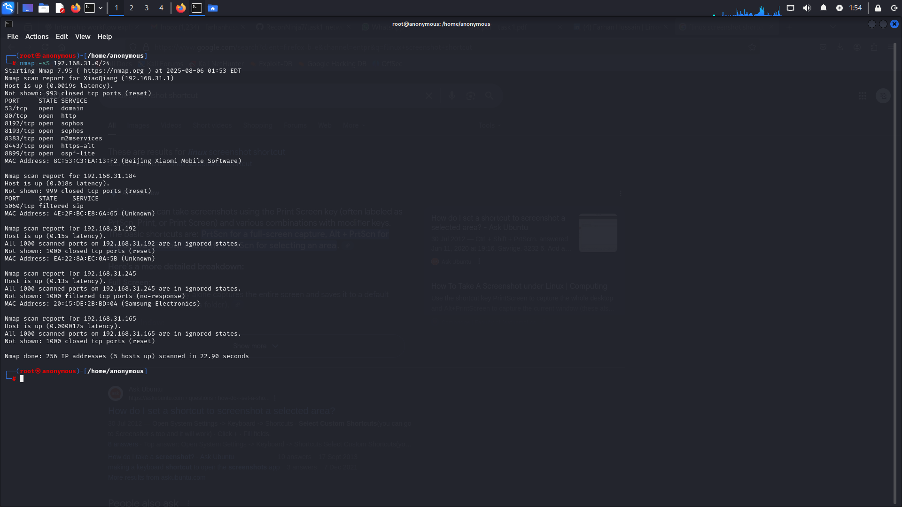
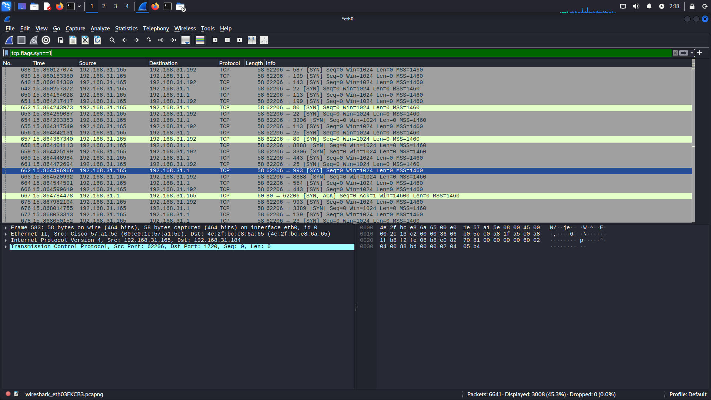

#  Task 1 – Network Port Scanning | Elevate Labs Cybersecurity Internship

This project demonstrates basic network reconnaissance using **Nmap** and **Wireshark**, focusing on identifying open ports in a private network. It was completed as part of the Elevate Labs Cybersecurity Internship.

---

 **Tools Used**
- **Nmap** – For port scanning (`-sS` TCP SYN scan)
- **Wireshark** – For packet analysis

---

## Objectives
- Learn how to identify devices on a local network
- Discover open ports and understand their associated services
- Assess potential risks associated with exposed ports

---

##  Steps Performed
1. Identified local IP range using `ip a`  
   → Example: `192.168.x.x/24`
2. Ran a TCP SYN scan using:
   ```bash
   nmap -sS 192.168.x.x/24
   

## Nmap Scan Screenshot

Below is a terminal screenshot showing the result of a **TCP SYN scan** performed using **Nmap** on the local network (`192.168.31.0/24`).



## Wireshark Screenshot

Below is a packet capture taken using Wireshark while running a TCP SYN scan with Nmap.  
It shows SYN packets being sent from the scanning host (`192.168.31.165`) to multiple ports on `192.168.31.1`.



🔹 Author: Mohammad Farhan Hussain
🔹 Internship: Elevate Labs Cybersecurity Internship
🔹 Tools: Nmap, Wireshark, Kali Linux


